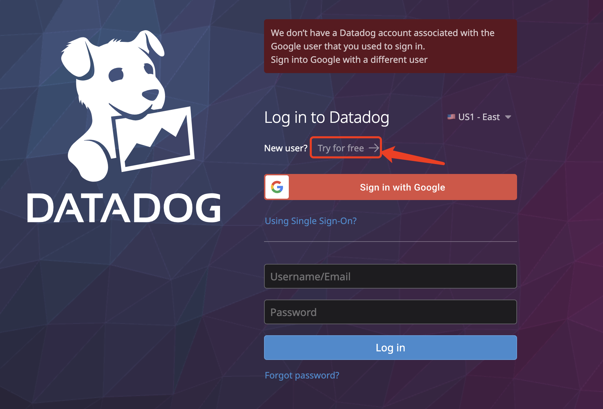
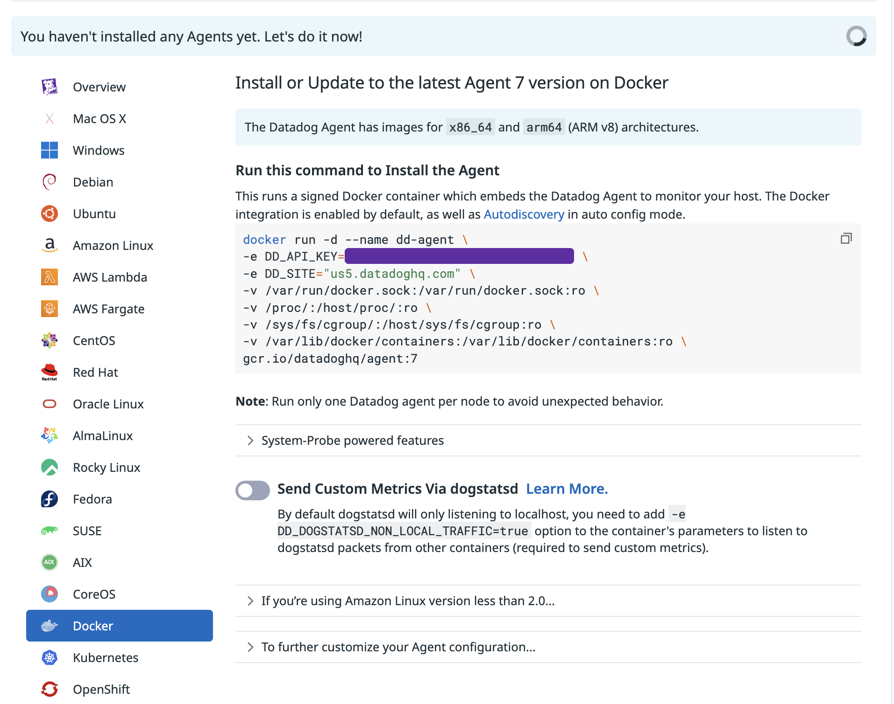

# Datadog

## What is Datadog?

Datadog is a monitoring and analytics platform that integrates with cloud providers, databases, and other services to provide real-time insights into the performance of your applications and infrastructure. Datadog offers a range of monitoring tools, including application performance monitoring (APM), infrastructure monitoring, and log management.

## Datadog Features

- **APM**: Monitor the performance of your applications and services in real-time.
- **Infrastructure Monitoring**: Monitor system-level metrics, such as CPU, memory, and disk usage.
- **Log Management**: Collect, analyze, and visualize log data from your applications and services.
- **Custom Metrics**: Collect and visualize custom metrics using StatsD or other monitoring tools.
- **Alerting and Notifications**: Set up alerts and notifications based on predefined thresholds or custom metrics.
- **Dashboards**: Create custom dashboards to visualize and monitor your metrics in real-time.
- **Machine Learning**: Use machine learning algorithms to analyze and predict trends in your monitoring data.
- **Real User Monitoring**: Monitor the performance of your applications from the perspective of real users using Datadog's real user monitoring tools.
- **Synthetic Monitoring**: Monitor the availability and performance of your applications using synthetic monitoring tools.
- **Mobile App Monitoring**: Monitor the performance of your mobile applications using Datadog's mobile app monitoring tools.
- **API Monitoring**: Monitor the performance and availability of your APIs using Datadog's API monitoring tools.
- **Database Monitoring**: Monitor the performance of your databases using Datadog's database monitoring tools.

## Onboarding with Datadog

To get started with Datadog, you need to create an account on the Datadog website and obtain an API key. You can then use the API key to authenticate your monitoring agents and services with Datadog.

### Datadog API Key
Create a Datadog account and obtain an API key from the Datadog dashboard. The API key is used to authenticate your monitoring agents and services with Datadog.

Use the following steps to create a Datadog API key:
- Go to the Datadog website and sign up for an account. https://app.datadoghq.com/account/login?next=%2F

- Select Docker as the Datadog Agent installation method and follow the instructions to install the Datadog Agent on your system.

